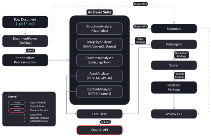

# doc-grader

[](LICENSE)


[](https://www.vut.cz/en/students/final-thesis/detail/169958)

**An evidence-linked assistant for grading student project documentation** - built as a Bachelor's thesis at the Faculty of Information Technology, Brno University of Technology (FIT BUT).

`doc-grader` reads a student's PDF or Markdown documentation, checks it against a course's grading rubric using a mix of deterministic rules, local ML models, and LLMs, and hands the grader a list of concrete, per-criterion findings - each one pointing at the exact passage or diagram it came from, with a confidence score and a reason. The grader stays in control of every point deducted; the tool just does the first, tedious pass.

It's used for the *Formal Languages and Compilers* (IFJ) and *Principles of Programming Languages* (IPP) courses at FIT BUT, where documentation review previously meant manually re-reading hundreds of near-identical reports every semester.

<p align="center">
  
</p>

*Every finding links back to exactly where it came from in the original document - no black-box scores.*

## Why this exists

Grading code is largely automated; grading the documentation that goes with it is not. Student reports have a fixed structure, reference an external project specification, and mix prose with code snippets, tables, and formal diagrams (finite automata, UML class diagrams) - territory where generic essay-scoring tools fall short.

`doc-grader` is deliberately **not** a fully autonomous grader. It's a filter: it surfaces likely issues with evidence attached, and a human grader decides what actually costs points. That framing came directly from analysing 11 years of historical grading data, which showed real inconsistency in how the same mistakes were scored across graders and semesters.

## How it works

<p align="center">
  
</p>

1. **Parse** - [Docling](https://github.com/docling-project/docling) converts the PDF/Markdown submission into a single intermediate representation, preserving the exact coordinates of every text block and figure.
2. **Analyse** - five analysers each own a slice of the rubric, routed to the cheapest technology that can do the job reliably:
   - **Structure** & **Grammar** run local, deterministic checks (heuristics, LanguageTool).
   - **Integrity** uses a local bi-encoder (BAAI/bge-m3) to catch undisclosed overlap with the official assignment spec.
   - **Asset** runs a fine-tuned vision-language model plus GPT-4o to judge UML/diagram correctness.
   - **Content** uses the GPT-5.4 family for the criteria that need broader reading comprehension.
3. **Judge** - an LLM judge pass reviews candidate findings and filters out false positives before they're scored.
4. **Score & review** - findings are aggregated into calibrated point deductions and served through a Streamlit UI, where every finding stays anchored to its evidence in the original document.

## Catching more than text

The asset analyser doesn't just check that a diagram exists - it evaluates whether it's a *correct* UML class diagram for the student's own code, cross-referencing the rendered image against the rubric.

<p align="center">
  
</p>

## Results

Evaluated against 100 historical IPP submissions with known human-assigned grades:

- **95.6% accuracy** on the visual UML/diagram correctness check against human grading.
- Local, deterministic checks (structure, grammar) matched human judgement reliably at zero API cost.
- For semantically harder criteria, **GPT-5.4 Mini for extraction + full GPT-5.4 as judge** came out as the best cost/quality trade-off among the configurations tested.
- A live pilot deployment in an ongoing semester is evaluating real-world time savings and grader agreement.

Full methodology, dataset analysis, and limitations are in the thesis itself: **[Read the full thesis on VUT's digital library](https://www.vut.cz/en/students/final-thesis/detail/169958)** (defended 2026, won Dean's Award for Outstanding Bachelor's Thesis and State Final Examinations).

## Repository layout

- `doc_grader/`: runtime package and CLI
- `config/`: presets, experiments, and rulebooks
- `docs/`: project and architecture documentation
- `notebooks/`: analysis and evaluation notebooks
- `sample_data/`: bundled IFJ/IPP samples and specs
- `out/`: generated runtime outputs and bundled demo runs

## Installation

See [INSTALL.md](INSTALL.md).

## Usage

For routine runs, ensure your environment is activated (for example, `conda activate doc-grader` or `source .venv/bin/activate`), then use the command-line entry point:

```bash
doc-grader <path_or_folder>
```

General patterns:

```bash
# single file
doc-grader path/to/submission.pdf

# student folder
doc-grader path/to/student-folder

# cohort folder
doc-grader path/to/cohort-folder
```

### Example Runs

Quick checks on the bundled samples in `sample_data/`:

```bash
# IPP 2024/2025 individual preset
doc-grader sample_data/ipp/ipp2425/int/int_xcsi-25ac8af4 -c config/presets/ipp_2024_25_int.json -o out/sample_ipp_int

# IPP 2024/2025 parser preset
doc-grader sample_data/ipp/ipp2425/parser/parser_xcsi-25ac8af4 -c config/presets/ipp_2024_25_par.json -o out/sample_ipp_par

# IFJ 2024/2025 preset
doc-grader sample_data/ifj/ifj2425/xcsi-25ac8af4 -c config/presets/ifj_2024_25.json -o out/sample_ifj

# External-friendly fallback (no private classifier dependency)
doc-grader sample_data/ipp/ipp2425/int/int_xcsi-25ac8af4 -c config/experiments/generic_classifier_fallback.json -o out/sample_fallback

# Parse-only smoke check
doc-grader sample_data/ipp/ipp2425/int/int_xcsi-25ac8af4 -c config/experiments/parse_only.json -o out/sample_parse_only

# Local-only run (no LLM calls)
doc-grader sample_data/ipp/ipp2425/int/int_xcsi-25ac8af4 -c config/experiments/local_only.json -o out/sample_local_only
```

Note: the bundled IPP sample filenames (`readme1.pdf`, `readme2.md`) are intentionally non-canonical, so parser finding `DOCTYPE` appears in sample outputs.

### CLI options

| Option                 | Description                             |
|------------------------|-----------------------------------------|
| `-h, --help`           | Show help message                       |
| `-d, --debug`          | Enable debug logging                    |
| `-o, --out PATH`       | Output directory                        |
| `-c, --config PATH`    | Config file                             |
| `--csv-out PATH`       | Write merged CSV findings               |
| `--clean-csv-out PATH` | Write all findings as dataset-style CSV |
| `--skip-existing`      | Skip students with existing outputs     |

## Review UI

A read-only Streamlit interface is available for inspecting saved runs:

```bash
streamlit run doc_grader/ui/app.py
```

In the sidebar, load any run directory under `out/` that contains `findings.json`:

<p align="center">
  
</p>

The right panel then shows a per-code summary of normalised deductions, with filters and sorting for drilling into individual findings:

<p align="center">
  
</p>

For immediate viewing, bundled demo run outputs are available at `out/sample_par/` and `out/sample_int/`.

The sample commands above create their own output folders (`out/sample_ipp_int/`, `out/sample_ipp_par/`, `out/sample_ifj/`, `out/sample_fallback/`, `out/sample_parse_only/`, and `out/sample_local_only/`).

## Quick Links

- Architecture, model routing, and expected outputs: [docs/overview.md](docs/overview.md)
- Setup and fallback configurations: [INSTALL.md](INSTALL.md)
- Configuration profiles and presets: [config/configs.md](config/configs.md)

## License

This project is licensed under the GNU General Public License v3.0 (GPL-3.0). See the [LICENSE](LICENSE) file for details.

Because `doc-grader` relies on the [`language-tool-python`](https://github.com/jxmorris12/language_tool_python) library, it adopts its GPL-3.0 license.
