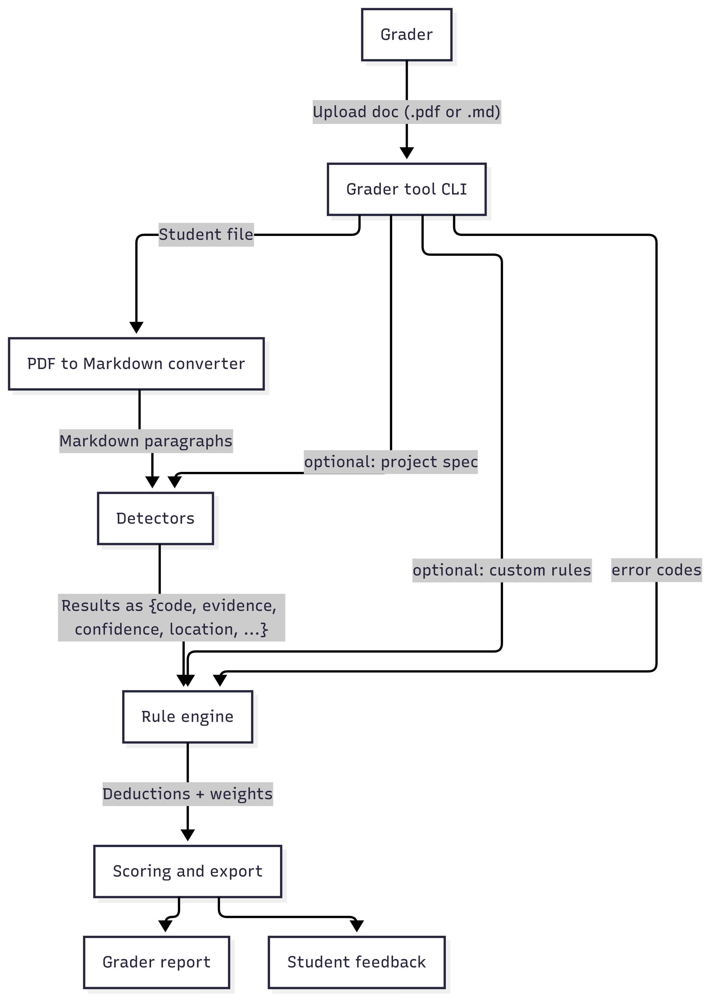

# Tool overview - v0.2 (6. 8. 2025)

Helper for grading IFJ/IPP project documentation.

## 1. Motivation

Manual grading is slow and inconsistent.
The tool flags parts of the file which it thinks should affect the score negatively, explains why and suggests a point deduction. Optionally provides natural language feedback to the grader and/or student.

## 2. Typical flow

- Convert PDF to Markdown to paragraphs
- Run detectors, get list of findings `{code, evidence, confidence, location, ...}`
- Rule engine transforms findings into error codes
- Aggregate deductions and suggest score
- Generate reports

## 3. Inputs

| Item                  | Format                              | Notes              |
| --------------------- | ----------------------------------- | ------------------ |
| Student documentation | .pdf or .md                         | required           |
| Project assignment    | .pdf or .md                         | optional           |
| Error-code table      | `.yaml`, `.json`, or other list     | required           |
| Custom grading rules  | natural language/custom error codes | optional overrides |

## 4. Outputs

| For grader                                               | For student                                           |
| -------------------------------------------------------- | ----------------------------------------------------- |
| List of deductions                                       | Plain-text list of approved deductions and reasonings |
| Suggested total score and individual deduction weights   | Summary feedback                                      |
| Highlighted sections in UI (optional)                    |                                                       |
| Batch error summaries, trends across projects (optional) |                                                       |

## 5. Design overview

### Key components

1. PDF to markdown converter (pdfminer-six?)
2. Local dataset of past docs/assignments/rules...
   - for training/validation of models, few-shot examples for LLMs
3. **Detectors**  
   - copied spec text, required sections, required diagrams …  
   - each returns `{code, evidence, confidence, location, ...}`
4. **Rule engine**  
   - maps detector output to a code table  
   - applies default deduction, allows user override
5. Scoring + export (JSON / plain text)
6. CLI prototype (GUI later)

### Detectors

Automatically identify specific issues in student documentation (e.g., missing diagrams, copied spec text, incorrect structure). Each detector outputs `{code, evidence, confidence, location, ...}`. They should be optional, with easy enable/disable.

| Detector                    | Possible approach            | Notes                               |
| --------------------------- | ---------------------------- | ------------------------------------|
| Copied spec text            | SBERT embeddings?            | Source doc required                 |
| Required sections structure | Markdown heading parser      | Allow config of required sections   |
| Diagram presence            | Image tag detection or OCR?  | Vision model needed? needs research |
| Language/formality          | Style check via LLM?         | Local or API? how to specify this?  |
| Length/Completeness         | Heuristic (word count?)      | Project specific thresholds?        |
| Plagiarism (optional)       | External API or local?       | out of scope probably?              |

Confidence calibration method?

## Rule engine

Convert raw detector findings into actionable grading deductions. Inputs are `{code, evidence, confidence, location, ...}` + error code definitions -> output = `{deduction, weight, reason, ...}`

| Feature             | Possibly approach                 | Notes                                 |
| ------------------- | --------------------------------- | ------------------------------------- |
| Mapping method      | Static YAML/JSON config ?         | Learned mapping out of scope for now? |
| Deduction weights   | Fixed vs. adaptive per doc?       | Allow per-project/ overrides?         |
| Thresholds          | Confidence cut-off per detector ? | Manual tuning or learned thresholds?  |
| Conflict resolution | Deduplication logic ?             | One deduction per issue type?         |
| Grader overrides    | CLI flag?                         | File-based override format?           |
| Batch scoring       | -                                 | out of scope probably                 |
| Explainability      | -                                 | examples of evidence in reports?      |

- Possible feedback loop for tuning rule accuracy over time?

### Design diag (v0.2)

## 6. Design questions

- Local models vs. OpenAI API for detectors
- How to handle image/diagram checks
- Evaluation strategy. how to measure the accuracy and effectiveness of the detectors, and the final grading (precision/recall against manual grading)
- Security/privacy
