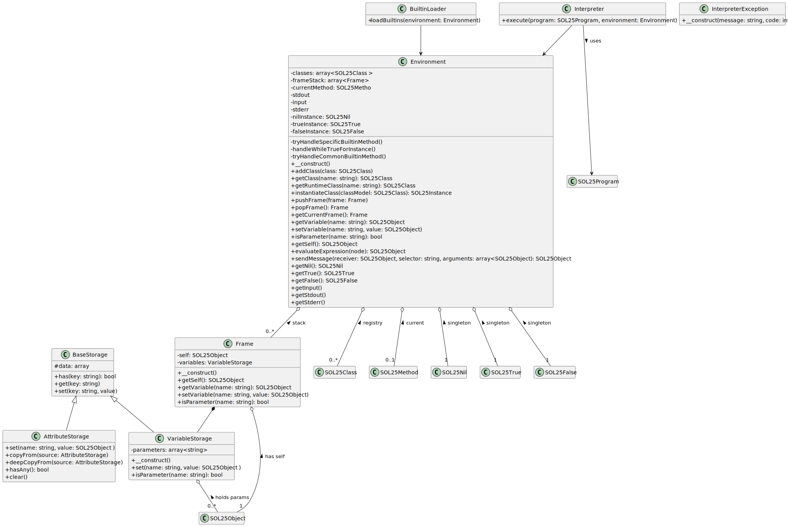
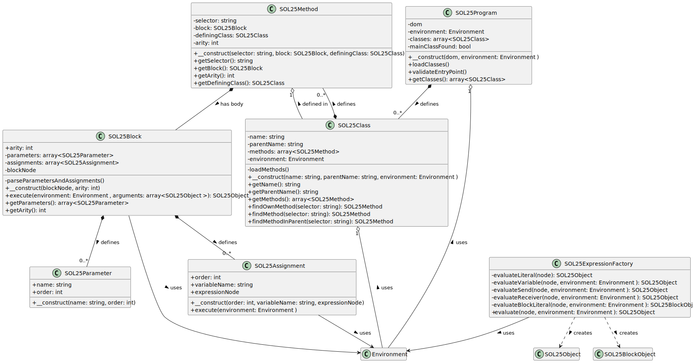
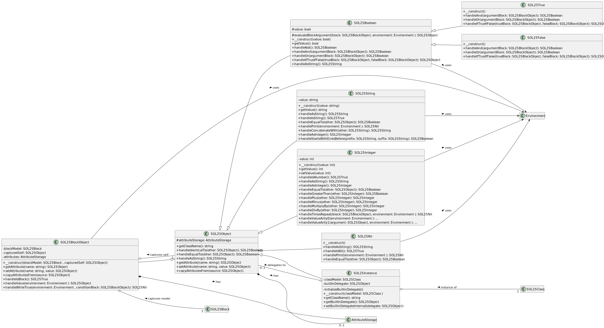

Implementation documentation for the 2nd task for IPP 2024/2025

Name and surname: Matúš Csirik

Login: xcsirim00

## 1. Introduction

This document describes the SOL25 interpreter implementation for the IPP Project 2 (2025). The interpreter processes the XML representation of the SOL25 language, executing the program according to its semantics. It utilizes the provided `IPP\Core` framework, with the core logic residing in the `IPP\Student` namespace.

The implementation consists of:

1. A `Model` namespace for classes representing the static program structure from XML.
2. An `Objects` namespace defining the SOL25 runtime object system.
3. Execution components (`Environment`, `Frame`, `Storage` classes) managing runtime state.

## 2. Architecture overview

The architecture is object-oriented, centered around message passing between runtime objects:

1. **Core integration (`Interpreter.php`):** Bridges the core (`IPP\Core\Engine`) with the implementation.
2. **XML model (`IPP\Student\Model`):** Represents the static code structure (e.g., `SOL25Program`, `SOL25Class`, `SOL25Method`) and defines the blueprints for runtime objects.
3. **Expression evaluation (`SOL25ExpressionFactory`):** A factory that translates XML expressions into runtime `SOL25Object` instances, according to their types.
4. **Runtime object system (`IPP\Student\Objects`):** The heart of the OOP design. Defines the hierarchy (`SOL25Object` base) enabling **polymorphism**. Concrete classes (`SOL25Integer`, `SOL25Instance`, etc.) **encapsulate** state and behavior.
5. **Execution environment (`Environment.php`, `Frame.php`):** Manages the dynamic state, including the call stack (`Frame` objects representing activation records) and handles **message sending**, the primary mechanism for starting object behavior.
6. **Storage (`VariableStorage.php`, `AttributeStorage.php`):** Provides mechanisms for storing local variables (frame scope) and dynamic object attributes (instance scope), supporting object state.
7. **Built-in setup (`BuiltinLoader.php`):** Initializes the `Environment` with fundamental classes and singleton objects, establishing the base object system.
8. **Error handling (`InterpreterException.php`):** Uses exceptions to signal semantic/runtime errors.

## 3. Object model (class reference)

Efforts to make a universal but readable class diagram resulted in splitting it to three, each according to its proper namespace. In the process some method names or parameter lists had to be shortened to preserve readability. The diagrams were generated via PlantUML.

### 3.1 Execution environment classes

Manage the dynamic state of the interpreter during execution.



| Class               | Responsibility                                                                 | Key aspects                                                                                                                               |
| ------------------- | ------------------------------------------------------------------------------ | ----------------------------------------------------------------------------------------------------------------------------------------- |
| `Environment`       | Represents the global state and manages execution.                        | Holds class registry, singletons (`nil`, `true`, `false`), manages the call stack (`Frame` objects), central message sending (`sendMessage`). |
| `Frame`             | Represents a single execution context (method or block invocation).            | Holds local variables (`VariableStorage`), the current `self` object, and parameter values. Stacked within `Environment`.                   |
| `VariableStorage`   | Manages local variable storage within a `Frame`.                               | Simple key-value store (associative array) for variables defined within a method or block scope.                                          |
| `AttributeStorage`  | Manages dynamic attributes associated with `SOL25Object` instances.            | Key-value store (associative array) associated with each object instance that needs dynamic attributes. Lazy initialization.                |
| `BaseStorage`       | Abstract base class providing common functionality for storage classes.        | Defines basic `get`, `set`, `exists` operations used by `VariableStorage` and `AttributeStorage`.                                         |
| `BuiltinLoader`     | Initializes the `Environment` with built-in classes and singletons.          | Creates and registers `Object`, `Integer`, `String`, `Boolean`, `Nil`, `True`, `False` classes and the singleton instances.             |
| `Interpreter`       | Entry point for the student implementation, bridges `IPP\Core` and `IPP\Student`. | Receives `DOMDocument`, initializes `Environment`, loads classes via `SOL25Program` and starts execution with `Main`.         |
| `InterpreterException`| Custom exception class for SOL25-specific errors.                            | Carries the error message and the corresponding `ReturnCode` for reporting interpreter errors according to the specification.             |

### 3.2 Model classes (`IPP\Student\Model`)

Represent the static structure of the SOL25 program parsed from XML.



| Class                   | Responsibility                                                                 | Key aspects                                                                                                |
| ----------------------- | ------------------------------------------------------------------------------ | ---------------------------------------------------------------------------------------------------------- |
| `SOL25Program`          | Represents the root `<program>` element. Loads and validates class definitions. | Entry point for model creation, checks for `Main` class and duplicate definitions (Error 51, 31).            |
| `SOL25Class`            | Represents a `<class>` definition.                                             | Holds class name, parent name, and methods. Handles method lookup (including inheritance) and redefinition checks (Error 51, 52). |
| `SOL25Method`           | Represents a `<method>` definition.                                            | Holds selector, arity (derived from block), defining class, and the method body (`SOL25Block`).            |
| `SOL25Block`            | Represents a `<block>` element (method body or block literal).                 | Holds arity, parameters (`SOL25Parameter`), and assignments (`SOL25Assignment`). Responsible for sequential execution of assignments. |
| `SOL25Parameter`        | Represents a `<parameter>` definition within a block.                          | Holds parameter name and 1-based order. Validates attributes (Error 42).                                   |
| `SOL25Assignment`       | Represents an `<assign>` statement within a block.                             | Holds 1-based order, target variable name, and the expression (`<expr>`) to evaluate. Prevents assigning to parameters (Error 52). |
| `SOL25ExpressionFactory`| Static factory to evaluate `<expr>` nodes from the XML.                        | Recursively evaluates literals, variables, message sends (`<send>`), and block literals, producing runtime `SOL25Object` instances. |

### 3.3 Runtime object classes (`IPP\Student\Objects`)

Represent runtime values manipulated during execution.



| Class| Responsibility | Key aspects |
| ----------------- | ------------------------------------------------------------------------------ | ----------------------------------------------------------------------------------------------------------------------------------------- |
| `SOL25Object`     | Abstract base class for all runtime objects.                                   | Provides default implementations for common methods (`identicalTo:`, `equalTo:`, `asString:`), dynamic attribute storage (`AttributeStorage`). |
| `SOL25Instance`   | Represents an instance of a user-defined class.                                | Holds a reference to its `SOL25Class` model and manages dynamic attributes. May contain a `builtInDelegate` if inheriting directly from Integer or String. |
| `SOL25Integer`    | Represents an integer value.                                                   | Implements arithmetic (`plus:`, `minus:`, etc.), comparison (`equalTo:`, `greaterThan:`), and control flow (`timesRepeat:`) methods. Handles delegation from `SOL25Instance`. |
| `SOL25String`     | Represents a string value. | Implements concatenation (`append:`), length (`length`), character access (`at:`), comparison (`equalTo:`, `greaterThan:`), I/O (`print`, `read`), conversion (`asInteger`), and class creation (`from:`). Handles delegation from `SOL25Instance`. |
| `SOL25Boolean`    | Abstract base for `SOL25True` and `SOL25False`.                                | Defines common boolean operations (`not`, `and:`, `or:`, `ifTrue:ifFalse:`).                                                               |
| `SOL25True`       | Singleton representing the boolean value `true`.                               | Implements logic for `and:`, `or:`, and `ifTrue:ifFalse:`.                                                               |
| `SOL25False`      | Singleton representing the boolean value `false`.                              | Implements logic for `and:`, `or:`, and `ifTrue:ifFalse:`.                                                               |
| `SOL25Nil`        | Singleton representing the `nil` value.                                        | Implements specific behaviors like `isNil`, `print` (prints empty string), `equalTo:`.                                                      |
| `SOL25BlockObject`| Represents a runtime block literal (closure).                                  | Captures the defining `SOL25Block` model and the `self` context where it was created. Implements `value` (execution) and `whileTrue:`. Manages its own attributes. |

## 4. Processing pipeline

The interpreter executes in the following sequence:

1. **Environment setup (`Interpreter`, `Environment`, `BuiltinLoader`):**
    - `Interpreter` creates the `Environment`.
    - `BuiltinLoader::loadBuiltins()` populates the `Environment` with built-in classes and singletons.

2. **Program model loading (`SOL25Program`, `SOL25Class`, etc.):**
    - `SOL25Program` is created using the `DOMDocument` and `Environment`.
    - `SOL25Program::loadClasses()` iterates through `<class>` elements:
        - Creates `SOL25Class` models.
        - Performs semantic checks (duplicates, redefinitions).
        - Loads methods (`SOL25Method`) and bodies (`SOL25Block`).
        - Registers `SOL25Class` models in the `Environment`.
    - `SOL25Program::validateEntryPoint()` ensures `Main` class and `run` method (arity 0) exist.

3. **Execution start (`Interpreter`, `Environment::sendMessage`):**
    - `Interpreter` retrieves the `Main` class model.
    - Sends `new` message to `Main` class via `Environment::sendMessage` to create the initial instance.
    - Sends `run` message to the `Main` instance via `Environment::sendMessage`.

4. **Message sending loop (`Environment::sendMessage`, `SOL25ExpressionFactory`, `SOL25Block::execute`):**
    - Execution proceeds via message sends handled by `Environment::sendMessage`.
    - For each send: Evaluate arguments (`SOL25ExpressionFactory::evaluate`), look up method, push `Frame`, execute method/block (`SOL25Block::execute`), pop `Frame`, return result.

5. **Termination (`Interpreter`, `Engine`):**
    - Execution ends when the initial `Main.run` message returns.
    - `InterpreterException` instances are caught.
    - `Interpreter::interpret` returns the final `ReturnCode`.
    - `Engine` prints any error messages to `stderr` and exits with the `ReturnCode`.

## 5. Key algorithms & implementation details

### 5.1 Message sending (`Environment::sendMessage`)

Message sending via `Environment::sendMessage` follows this lookup order:

1.  **Built-in handler:** Checks for a receiver method `handle<Selector>` (e.g., `handlePlus`). Arity-specific handlers (`handleValueArity1`) are checked before generic ones (`handleValue`).
2.  **User-defined method:** If no built-in handler exists, searches the receiver's class (`SOL25Class`) and its inheritance chain for a matching method (selector and arity).
    - For `super` sends, the search starts from the parent class of the current method's defining class.
3.  **Attribute access (implicit getter):** For zero-argument messages to instances (`SOL25Instance`, `SOL25BlockObject`) with no matching method, checks for a dynamic attribute with the same name as the selector.
4.  **Attribute access (implicit setter):** For one-argument messages ending in `:` to instances (`SOL25Instance`, `SOL25BlockObject`) with no matching method, sets the dynamic attribute corresponding to the selector base name. Returns `self`.
5.  **Built-in delegation (`SOL25Instance`):** If an `SOL25Instance` directly inherits `Integer` or `String`, and no user method or attribute is found, the message is delegated to the internal `builtInDelegate` (`SOL25Integer` or `SOL25String`).
6.  **Does not understand:** If no match is found, throws `InterpreterException` (`ReturnCode::INTERPRET_DNU_ERROR`, 51).

### 5.2 Expression evaluation (`SOL25ExpressionFactory`)

`SOL25ExpressionFactory::evaluate` takes an `<expr>` DOMElement and `Environment`, determines the child element type (literal, var, send, block), and calls a helper:

- `evaluateLiteral`: Creates `SOL25Integer`, `SOL25String`, or returns singletons (`nil`, `true`, `false`).
- `evaluateVariable`: Handles keywords (`nil`, `true`, `false`, `self`) or looks up the variable in the current `Frame`.
- `evaluateSend`: Parses receiver, selector, and arguments. Recursively evaluates receiver/arguments. Handles class messages and `super` sends. Calls `Environment::sendMessage`.
- `evaluateBlockLiteral`: Creates an `SOL25Block` model and wraps it in an `SOL25BlockObject`, capturing the current `self`.

### 5.3 Variable and attribute storage

- **Local variables (`VariableStorage` in `Frame`):** PHP associative array mapping variable names to `SOL25Object` instances within a `Frame`.
- **Dynamic attributes (`AttributeStorage` in `SOL25Object`):** Lazily initialized associative array mapping attribute names to `SOL25Object` instances, associated with an object.
- **`BaseStorage`:** Abstract base class with common `get`, `set`, `exists`, `copyFrom` logic for storage classes.

### 5.4 Block execution (`SOL25BlockObject::handleValue`)

When a `value` message is sent to an `SOL25BlockObject`:

1. `handleValue` (or `handleValueArityN`) checks if the argument count matches the block's `arity` (Error 51 if mismatch).
2. A new `Frame` is created with `self` set to the `capturedSelf` from the `SOL25BlockObject`.
3. Parameters are bound to arguments and stored in the new frame's `VariableStorage`.
4. The new `Frame` is pushed onto the `Environment` stack.
5. `SOL25Block::execute` is called on the block model, iterating through assignments.
6. `SOL25Assignment::execute` evaluates its expression and stores the result in the current frame.
7. `SOL25Block::execute` returns the result of the last assignment (or `nil`).
8. The `Frame` is popped.
9. The result from step 7 is returned.

## 6. Error handling

Errors are managed by the `IPP\Core` framework and `IPP\Student\InterpreterException`.

- **XML and file errors (Core):**
  - Handled by Core, no need to comment. 

- **Semantic errors (Student):**
  - Detected during model loading (`SOL25Program`, `SOL25Class`).
  - Examples: Redefinitions (Error 51), missing `Main`/`Main.run` (Error 31), `super` as value (Error 52), assigning to parameter (Error 52), parent class not found (Error 52).
  - Signaled via `InterpreterException` with appropriate `ReturnCode`.

- **Runtime errors (Student):**
  - Detected during execution (message sending, evaluation, block execution).
  - Examples: DNU (Error 51), type errors (Error 53), division by zero (Error 53), index out of bounds (Error 57), negative `timesRepeat:` receiver (Error 57), variable not found (Error 52).
  - Signaled via `InterpreterException` with appropriate `ReturnCode`.

- **Internal errors:**
  - Indicate interpreter bugs.
  - Signaled via `InterpreterException` with `ReturnCode::INTERNAL_ERROR` (99).

`InterpreterException` instances are caught by `Interpreter::interpret` or `IPP\Core\Engine`. The `Engine` prints the error message to `stderr` and exits with the `ReturnCode`.

## 7. Testing and validation

The interpreter was validated using manual testing and supplemented by an external test suite.

### 7.1 Testing environment

- **Operating system:** Ubuntu 24.04 LTS (WSL 2).
- **PHP version:** PHP 8.4.
- **Core framework:** The provided `ipp-core` project skeleton.
- **Tools:** `php8.4`, `bash`, `diff`, `python`

### 7.2 Manual testing

Manual tests were the bread and butter during development:

- Using small, targeted `.sol` programs (their XML representations) to test specific features or edge cases.
- Running the interpreter with these custom inputs:

    ```bash
    php8.4 interpret.php --source=my_test.xml --input=my_input.txt > my_output.txt
    echo $? # Check return code
    # Manually inspect my_output.txt and stderr
    ```

- Using Xdebug [5] as a PHP Debug VSCode extension to inspect internal state (`Environment`, `Frame`, object attributes) during execution.

### 7.3 Automated testing

In addition to manual tests, the interpreter was extensively validated using an external test suite developed by fellow student Kubikuli [2]. This suite provides a comprehensive set of tests covering various aspects of the SOL25 language, including syntax, semantics, built-in functions, and error conditions.

The tests were executed using the provided scripts within the test suite repository, comparing the interpreter's output and return codes against expected results. This automated approach significantly improved test coverage and helped identify subtle bugs and regressions during development.

## 8. AI assistance acknowledgment

Per academic integrity requirements, AI tools (primarily GitHub Copilot [3] and Google Gemini [4]) were used during the development of this project.

Assistance included:

- Exploring different development startegies during prototyping.
- Generating bare skeleton code for a select few classes.
- Formatting this documentation.
- Providing examples for PHP features, syntax and common usage.
- Providing information about DOM manipulation.
- Trivial code completion and minor code refactoring to fit PHP standards.

Nevertheless, the essential logic, key architectural decisions, OOP design and specifically the code handling message sending logic, expression evaluation, environment and frame management, were all manually implemented, reviewed, and validated.

## 9. Bibliography

[1] NESFIT, VUT FIT. *IPP Project 2025: Interpreter of the SOL25 language* [online]. Available at: <https://www.fit.vut.cz/study/courses/IPP/public/project/>. [cit. 2025-04-22]. Project Specification.
[2] KUKUL'A, Jakub. *IPP_proj2-tests: Tests for IPP project 2 (SOL25 Interpreter)* [online]. GitHub repository, 2024. Available at: <https://github.com/Kubikuli/IPP_proj2-tests>. [cit. 2025-04-22].
[3] GitHub. *GitHub Copilot* [online]. GitHub, 2025. Available at: <https://github.com/features/copilot>. [cit. 2025-04-22].
[4] Google. *Gemini* [online]. Google, 2025. Available at: <https://gemini.google.com/>. [cit. 2025-04-22].
[5] Xdebug. *PHP Debug* [VS Code Extension]. Version 1.36.0. Visual Studio Marketplace, 2025. Available at: <https://marketplace.visualstudio.com/items/?itemName=xdebug.php-debug>. [cit. 2025-04-22].
